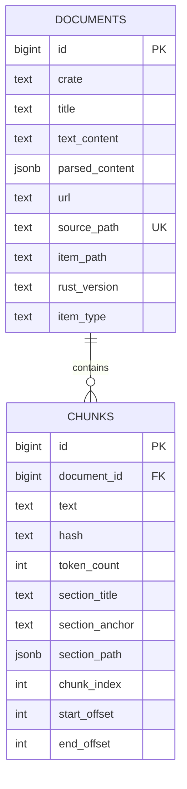

# Database Schema

## Purpose

This document describes the physical PostgreSQL schema for canonical parsed Rust
documentation and retrieval-ready chunks.

Source facts:
- data comes from locally downloaded Rust documentation HTML files
- supported documentation sets are `book`, `cargo`, `reference`, and `std`
- one HTML file maps to one row in `documents`
- one document maps to many rows in `chunks`
- `documents` stores normalized document-level content and metadata
- `chunks` stores retrieval-ready text spans for embeddings, search, and LLM context

## ER Diagram

## `documents`

Each row represents one parsed local HTML source file.

Columns:
- `id`: `BIGINT GENERATED ALWAYS AS IDENTITY PRIMARY KEY`
  - internal numeric document identifier
  - example: `1`
- `crate`: `TEXT NOT NULL`
  - documentation set name
  - example: `std`
- `title`: `TEXT NOT NULL`
  - parsed document/page title
  - example: `std::keyword::async`
- `text_content`: `TEXT NOT NULL`
  - full cleaned document text without HTML noise
  - example: `Keyword async\n\nReturns a Future instead of blocking the current thread...`
- `parsed_content`: `JSONB NOT NULL`
  - structured representation of the document after HTML parsing
  - maps from the ingest entity field currently named `structured_blocks`
  - example: `[{...}, {...}]`
- `url`: `TEXT NOT NULL`
  - canonical official Rust docs URL
  - example: `https://doc.rust-lang.org/std/keyword.async.html`
- `source_path`: `TEXT NOT NULL UNIQUE`
  - path to the source HTML file within the downloaded docs tree
  - stored with POSIX `/` separators for cross-platform stability
  - example: `std/keyword.async.html`
- `item_path`: `TEXT NULL`
  - logical Rust item path
  - example: `std::keyword::async`
- `rust_version`: `TEXT NULL`
  - Rust documentation version
  - example: `1.91.1`
- `item_type`: `TEXT NULL`
  - documentation item type
  - example: `module`, `struct`, `enum`, `trait`, `fn`, `keyword`, `primitive`, `page`, `unknown`

Constraints:
- `PRIMARY KEY (id)`
- `UNIQUE (source_path)`

## `chunks`

Each row represents one retrieval-ready text span derived from a document.

Columns:
- `id`: `BIGINT GENERATED ALWAYS AS IDENTITY PRIMARY KEY`
  - internal numeric chunk identifier
  - this is also the chunk identifier used by Qdrant/retrieval
  - example: `42`
- `document_id`: `BIGINT NOT NULL`
  - parent document reference
  - foreign key: `REFERENCES documents(id) ON DELETE CASCADE`
  - example: `1`
- `text`: `TEXT NOT NULL`
  - chunk text for embeddings, retrieval, and LLM context
  - example: `What is in the standard library documentation?\n\nFirst of all, ...`
- `hash`: `TEXT NOT NULL`
  - chunk text hash for deduplication and change detection
  - maps from the ingest entity field currently named `text_hash`
  - example: `4649b0ead394e8d62b96b728619526354aaf7195761f64a2e841bbde6979e73d`
- `token_count`: `INTEGER NULL`
  - chunk token count computed with the configured embedding model tokenizer
  - nullable for older rows or ingest runs where `EMBEDDING_MODEL` is not configured
  - example: `284`
- `section_title`: `TEXT NULL`
  - section title that contains the chunk
  - example: `What is in the standard library documentation?`
- `section_anchor`: `TEXT NULL`
  - section anchor or fragment id
  - example: `what-is-in-the-standard-library-documentation`
- `section_path`: `JSONB NULL`
  - section hierarchy as a JSON array of strings
  - example: `["Crate std", "What is in the standard library documentation?"]`
- `chunk_index`: `INTEGER NOT NULL`
  - chunk order within the document
  - example: `2`
- `start_offset`: `INTEGER NULL`
  - chunk start character offset relative to `documents.text_content`
  - example: `1704`
- `end_offset`: `INTEGER NULL`
  - chunk end character offset relative to `documents.text_content`
  - example: `2928`

Constraints:
- `PRIMARY KEY (id)`
- `FOREIGN KEY (document_id) REFERENCES documents(id) ON DELETE CASCADE`
- `UNIQUE (document_id, chunk_index)`

## Naming Alignment

Persistence should map current ingest-domain names to database names:

- ingest `Document.doc_id` is transient and is not stored in `documents`
- ingest `Chunk.chunk_id` is transient and is not stored in `chunks`
- ingest `Document.structured_blocks` maps to `documents.parsed_content`
- ingest `Chunk.text_hash` maps to `chunks.hash`
- database `documents.id` is the persisted document identifier
- database `chunks.id` is the persisted chunk identifier used by Qdrant/retrieval

## Query and Ingest Use

### Ingest path

1. Parse one local HTML file into a document entity.
2. Persist document-level fields to `documents`.
3. Persist derived retrieval chunks to `chunks`.
4. After PostgreSQL assigns `chunks.id`, upsert vectors to Qdrant using those numeric ids.
5. Qdrant payload stores only lightweight filter metadata, not canonical text.

### Query path

1. Qdrant returns numeric `chunks.id` values.
2. The backend loads canonical chunk rows from `chunks`.
3. The backend joins `chunks.document_id -> documents.id`.
4. Retrieved chunk text is assembled into LLM context.
5. Document metadata provides source attribution and filters.

Hydrated retrieval output should include `title`, `source_path`, `section`,
`item_path`, `snippet`, `crate`, and `item_type`.

Qdrant payload should stay minimal and omit `chunks.text`. The intended payload fields are
`chunk_id`, `document_id`, `crate`, `item_type`, `rust_version`, `source_path`,
`item_path`, `chunk_index`, and `hash`.

## Source of Truth

This document is the intended source of truth for:
- SQLAlchemy ORM models in `src/rust_assistant/models/`
- repository persistence mapping in `src/rust_assistant/repositories/`
- Alembic migrations in `alembic/versions/`
